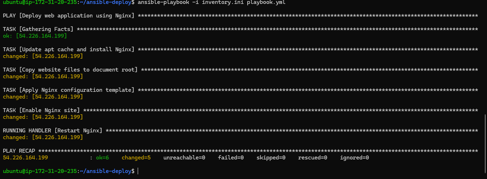
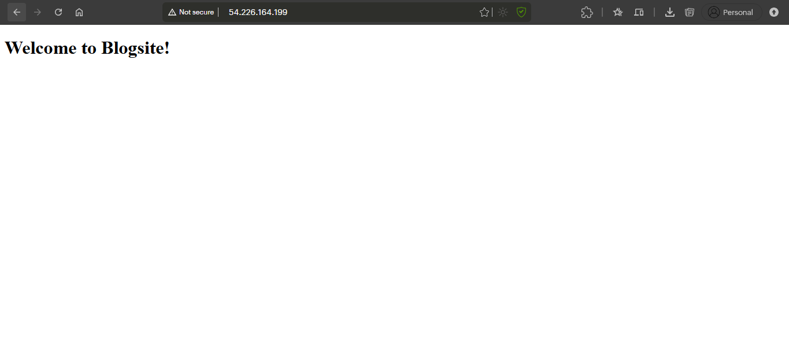

# Automated Web Application Deployment with Ansible

This project automates the deployment of a static web application on a remote server using Ansible. The playbook configures an Nginx web server, deploys the website files, and ensures the service is running correctly.

## 🚀 Project Overview

As a DevOps engineer, automating application deployment is a core task. This project uses Ansible to eliminate manual server setup. The Ansible playbook handles everything from installing Nginx to configuring the server and deploying the application code, making the process fast, repeatable, and error-free.

## 🏛️ Architecture & Tools

* **Ansible**: An automation tool used for configuration management and application deployment. It uses YAML playbooks to define tasks.
* **AWS EC2**: Two Ubuntu instances are used: one as the Ansible **controller node** (where Ansible commands are run) and one as the **target node** (where the website is deployed).
* **Nginx**: A high-performance web server used to host the static website.
* **Git & GitHub**: For version control of the Ansible project files.

## ✨ Project Screenshots

Here are the final results of the automated deployment.

**1. Ansible Playbook Executed Successfully**  


**2. Blogsite Deployed on the Server**  


## 🛠️ How to Deploy (Replicating This Project)

You can clone this repository and deploy the website on your own AWS infrastructure.

### Prerequisites

1. An **AWS Account**
2. Two Ubuntu EC2 instances (one controller, one target)
3. An EC2 Key Pair for SSH access
4. Ansible installed on the controller node
5. Security Group configured to allow inbound traffic on **port 22 (SSH)** and **port 80 (HTTP)**

### Deployment Steps

1. **Clone the repository:**  
   On your Ansible controller node, clone this repository.
   ```bash
   git clone https://github.com/harshraisaxena/ansible-nginx-webapp-deploy.git
   cd ansible-nginx-webapp-deploy
